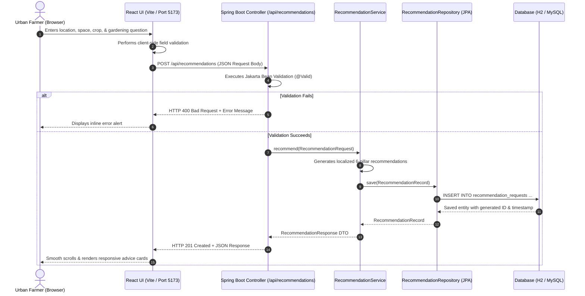

# Project 37: Urban Farming Community Knowledge Hub

A full-stack web application designed for urban agriculturists, community gardeners, and apartment dwellers. It provides localized recommendations covering **crops, soil, seeds, watering, pests, and seasonal care** based on location, space constraints (balcony, windowsill, rooftop, backyard, etc.), crop selection, and user questions.

---

## 📋 Functional Requirements & Verification Matrix

| Requirement | Implementation Details | Status |
| :--- | :--- | :---: |
| **Java 17+ & Spring Boot 3** | Java 17, Spring Boot 3.4.4, Spring MVC, Spring Data JPA | ✅ Implemented |
| **React Frontend** | React 18, Vite 5, Lucide React icons, Responsive CSS | ✅ Implemented |
| **REST APIs** | `/api/recommendations` (POST, GET, search query GET) | ✅ Implemented |
| **Database Persistence** | JPA/Hibernate, auto-schema generation, H2 dev + MySQL ready | ✅ Implemented |
| **Field Validation** | Bean Validation (`@NotBlank`, `@Size`), HTTP 400 with messages | ✅ Implemented |
| **Responsive UI States** | Loading spinner, error alerts, success notices, card grids | ✅ Implemented |
| **Application-Specific Advice** | 6 localized pillars: Crops, Soil, Seeds, Watering, Pests, Seasonal Care | ✅ Implemented |
| **Search & Filtering** | Community knowledge search by crop and city (`/search?q=...`) | ✅ Implemented |

---

## 🔄 Suggested REST / API Flow



---

## 🤖 Best AI Tools to Build & Extend this Application

1. **Google Antigravity / Gemini CLI** *(Pair Programming & Architecture)*:
   - Orchestrates multi-file refactoring, autonomous background testing, and full-stack project scaffold setup.
   - Ideal for generating Spring Boot services, JPA repositories, and Vite frontends in tandem.
2. **Spring AI & Google Gemini API** *(AI Recommendations Engine)*:
   - Replace or augment the rule-based recommendation logic with real-time AI by integrating `spring-ai-starter-model-gemini`.
   - Sends the grower's location, space, and USDA hardiness zone to Gemini 1.5/2.0 Flash to return dynamic agricultural guidance.
3. **v0.dev / Claude Code / Lovable** *(UI Prototyping)*:
   - For rapid drafting of agricultural dashboards, interactive garden planners, and seed-starting calendars.
4. **Perplexity / Weather & Soil APIs** *(Data Enrichment)*:
   - Plug into Open-Meteo or NASA POWER APIs via Spring `RestClient` to pull live rainfall, UV index, and frost alerts.

---

## 🏗️ Project Architecture & File Organization

```
Urban Farming Community Knowledge Hub/
├── .vscode/
│   └── launch.json                  # Multi-target debugging (Spring Boot & Chrome)
├── backend/                         # Spring Boot 3 REST API
│   ├── pom.xml                      # Maven dependencies & plugins
│   └── src/
│       ├── main/
│       │   ├── java/com/urbanfarm/
│       │   │   ├── KnowledgeHubApplication.java       # Spring Boot main class
│       │   │   ├── common/
│       │   │   │   └── ApiExceptionHandler.java       # @RestControllerAdvice global error handler
│       │   │   └── recommendation/
│       │   │       ├── RecommendationController.java  # POST, GET, and /search endpoints
│       │   │       ├── RecommendationRequest.java     # Request DTO with validations
│       │   │       ├── RecommendationResponse.java    # Response DTO with AdviceSection records
│       │   │       ├── RecommendationRecord.java      # JPA entity mapped to recommendation_requests
│       │   │       ├── RecommendationRepository.java  # JpaRepository query methods
│       │   │       └── RecommendationService.java     # 6-pillar localized advice logic & JSON mapping
│       │   └── resources/
│       │       ├── application.properties             # H2 in-memory db & MySQL configuration
│       │       └── static/                            # Bundled React production build
│       └── test/
│           └── java/com/urbanfarm/
│               └── KnowledgeHubApplicationTests.java  # Spring context verification test
├── frontend/                        # React + Vite Modern Frontend
│   ├── index.html                   # HTML5 root with semantic metadata
│   ├── package.json                 # React, Vite, Lucide-React
│   ├── vite.config.js               # Port 5173 and /api proxy configuration
│   └── src/
│       ├── main.jsx                 # React root mount
│       ├── App.jsx                  # Main interface connecting all feature tabs & REST APIs
│       ├── styles.css               # Modern glassmorphism, ambient gradients & dark mode tokens
│       ├── components/
│       │   ├── GlobalSearch.jsx     # Live dropdown search across all modules
│       │   ├── AuthModal.jsx        # Login & Register modal with 1-click demo accounts
│       │   ├── Calculators.jsx      # Potting mix, drip timer, and neem spray calculators
│       │   ├── TerraceEngineering.jsx # Structural load, beam distribution & waterproofing
│       │   └── Hydroponics.jsx      # Kratky bucket & NFT vertical systems
│       └── data/
│           ├── translations.js      # English and Telugu (తెలుగు) dictionaries
│           ├── cropsData.js         # Container crops catalog & companion planting
│           ├── pestsData.js         # Pest doctor & bio-remedy guide
│           ├── calendarData.js      # 12-Month sowing/harvesting matrix
│           └── tutorialsData.js     # Step-by-step garden blueprints with progress tracking
├── .gitignore
└── README.md
```

---

## 🚀 Step-by-Step Running Guide

### 1. Start the Backend API
In your terminal:
```powershell
cd backend
mvn spring-boot:run
```
* **API Base URL**: `http://localhost:8080`
* **H2 Database Console**: `http://localhost:8080/h2-console`
  * JDBC URL: `jdbc:h2:mem:urbanfarm`
  * User: `sa`
  * Password: *(empty)*

### 2. Start the Frontend Web App
In a second terminal:
```powershell
cd frontend
npm run dev
```
* **Web Application**: `http://localhost:5173`
* The Vite dev server will proxy API calls (`/api/...`) directly to `http://localhost:8080`.
* Alternatively, Spring Boot serves the production bundle directly at `http://localhost:8080`.

---

## 🔐 Demo User Credentials (1-Click Login Available)

| Account Type | Email | Password | Role |
| :--- | :--- | :--- | :--- |
| **Urban Grower** | `grower@urbanfarm.com` | `password123` | Urban Grower |
| **Agronomist** | `agronomist@urbanfarm.com` | `admin123` | Certified Agronomist |

---

## 📡 REST API Reference

### 🔐 Authentication Endpoints

#### `POST /api/auth/login`
Authenticate existing user.
```json
{
  "email": "grower@urbanfarm.com",
  "password": "password123"
}
```

#### `POST /api/auth/register`
Register new urban farmer profile with validation.
```json
{
  "name": "Sunita Rao",
  "email": "sunita@urbanfarm.com",
  "password": "password123",
  "role": "Terrace Farmer"
}
```

#### `GET /api/auth/me`
Check current authentication status.

---

### 🌱 Recommendations & Search Endpoints

#### `POST /api/recommendations`
Submit garden details to receive custom advice and persist it in the database.

**Sample Request Body:**
```json
{
  "location": "Brooklyn, NY",
  "space": "Balcony",
  "crop": "Cherry Tomatoes",
  "question": "How deep should the container be and what pest protection is best?"
}
```

**Sample Response (`201 Created`):**
```json
{
  "id": 1,
  "location": "Brooklyn, NY",
  "space": "Balcony",
  "crop": "Cherry Tomatoes",
  "question": "How deep should the container be and what pest protection is best?",
  "recommendations": [
    {
      "title": "What to grow",
      "advice": "On a Balcony, Cherry Tomatoes can thrive in containers. Choose bush or determinate varieties to minimize wind resistance and trellis securely.",
      "icon": "🌱"
    },
    {
      "title": "Soil",
      "advice": "Use a lightweight, sterile potting mix containing perlite, coco coir, and vermiculite. Avoid heavy garden soil which compacts in containers. Add 20% well-aged compost for slow-release nutrients.",
      "icon": "🪴"
    },
    {
      "title": "Seeds & planting",
      "advice": "Sow seeds at a depth approximately 2-3 times their diameter. Maintain consistent moisture during germination (7-14 days). Thin seedlings early so each Cherry Tomatoes plant has adequate airflow and root room.",
      "icon": "🌾"
    },
    {
      "title": "Watering",
      "advice": "Elevated spaces dry out quickly due to sun and wind. Water deeply in the early morning until water runs out the drainage holes. Mulch surface soil with straw or woodchips to retain moisture.",
      "icon": "💧"
    },
    {
      "title": "Pests",
      "advice": "Common urban pests for Cherry Tomatoes include aphids, spider mites, and whiteflies. Inspect leaf undersides weekly. Treat early with neem oil spray, horticultural insecticidal soap, or companion plant with marigolds and basil.",
      "icon": "🐞"
    },
    {
      "title": "Seasonal care",
      "advice": "In Brooklyn, NY, monitor seasonal frost dates and summer heatwaves. Provide afternoon shade netting if temperatures exceed 32°C (90°F) and shield containers from harsh prevailing winds.",
      "icon": "☀️"
    }
  ],
  "note": "Localized recommendations tailored for Brooklyn, NY in balcony. Consult local seasonal planting calendars for microclimate nuances.",
  "createdAt": "2026-10-05T06:18:00Z"
}
```

#### `GET /api/recommendations`
Retrieve all persisted community recommendations ordered by most recent.

#### `GET /api/recommendations/search?q={query}`
Filter community recommendations by crop name or city.

---

### 📸 Community Harvest Gallery Endpoints

#### `GET /api/gallery`
Retrieve all community harvest stories and photos.

#### `POST /api/gallery`
Share a new harvest story with location, crop, and photo URL.

#### `POST /api/gallery/{id}/like`
Increment the like count for a harvest post.

# URBAN-FARMINING
